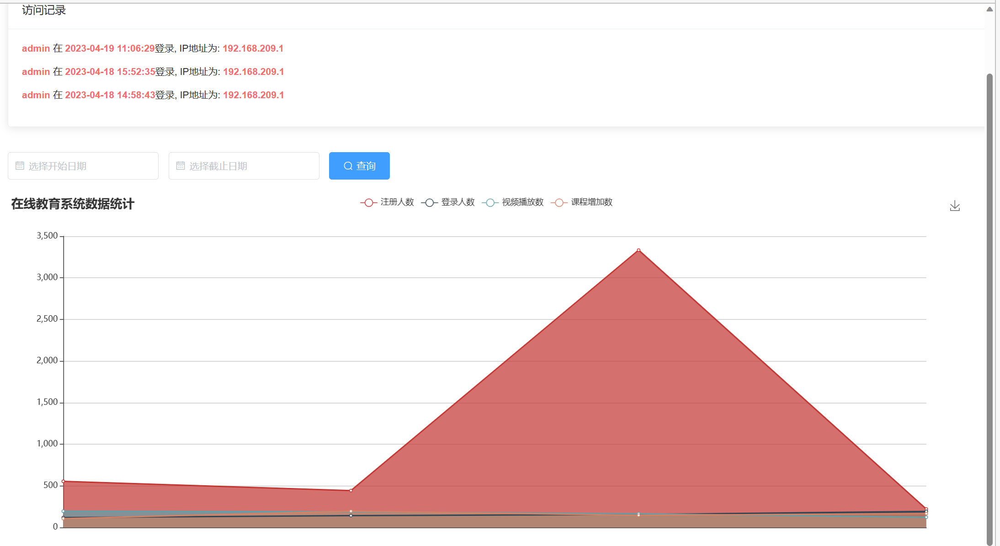
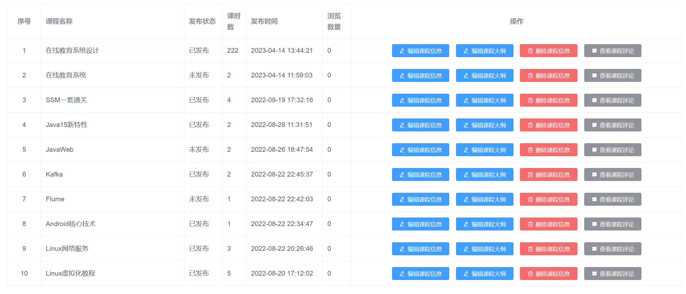
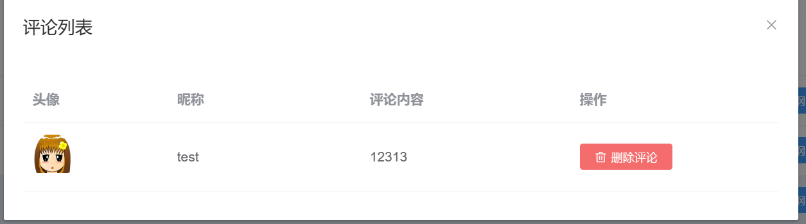
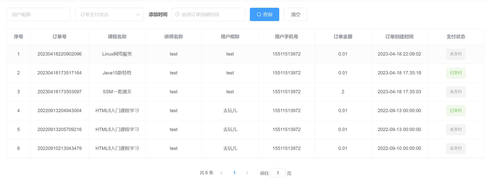

# 2023/4/18日

最近也是拿了谷粒学苑这个项目当做毕设，写了论文，修改了一下BUG，并增加了一些功能。
后续也会把论文免费分享出来，可以关注一下我的博客：https://blog.csdn.net/aetawt?type=blog

1、删除了统计模块，将统计移到门户界面，并增加了访问记录

2、修改了权限管理的BUG： 删除角色、用户不会删除对应关系

3、新增评论管理

4、新增订单管理

5、修改了前台系统一些 BUG